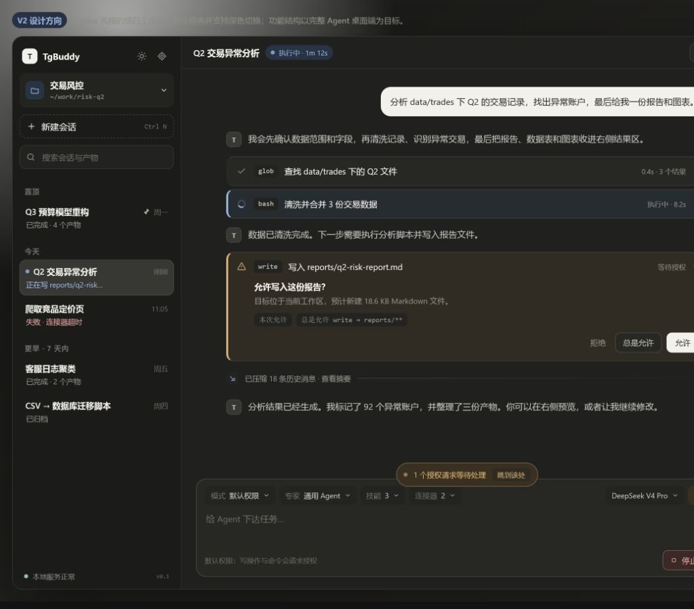
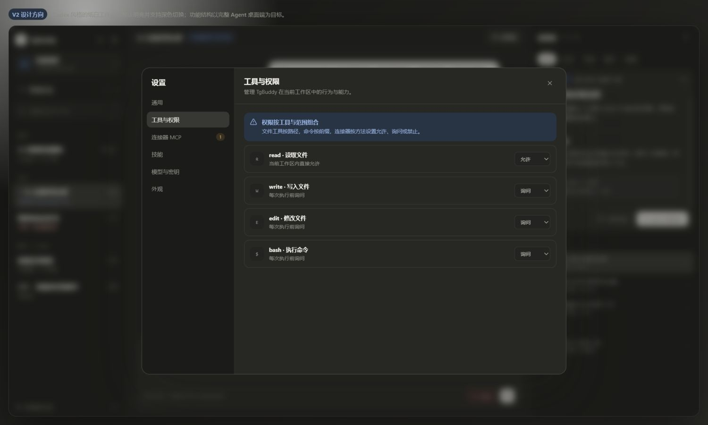
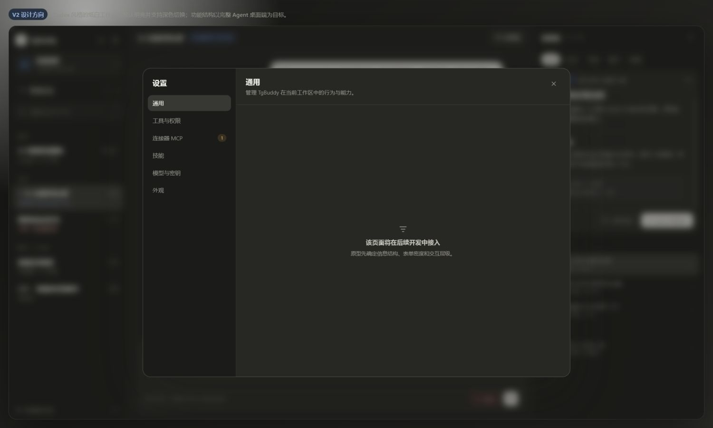
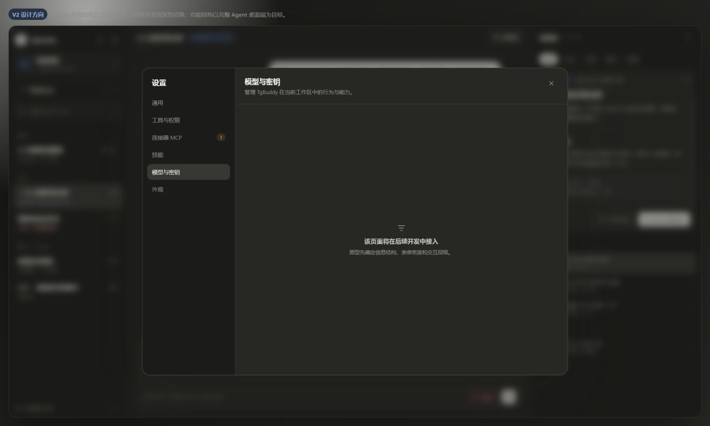

# TgBuddy 前端 UX/UI 完整性审计

日期：2026-08-01  
范围：Codex Light v2 设计稿、当前 Renderer/E2E、第一版功能范围  
目标：找出“功能已存在但未设计、设计与当前产品冲突、只有正常态没有恢复态”的缺口，并给出轻量 V3 设计覆盖。

## 1. 当前主任务

**健康度：部分可用。** 三栏信息层级、工具状态和 inline 授权方向正确；但 Composer 同时暴露模式、专家、Skill、连接器、模型和上下文，密度偏高，而且把 Skill/MCP 误表达成工作区级配置。结果预览只有一种 Markdown 演示，无法解释图片、表格、代码、大文件和读取失败。

可见可访问性风险：次要文字对比度偏低；多个纯图标按钮缺少可见标签，仍需实现阶段做键盘、屏幕阅读器和 200% zoom 验证。

## 2. 工具与权限设置

**健康度：与当前产品冲突。** 页面仍提供 per-tool“允许/询问/禁止”编辑器，而现有 E2E 已明确移除。正确结构应为：权限模式、真实持久规则、只读工具分类默认、高危不可逆说明。

可见可访问性风险：整张页面依赖灰色层级和紧密 select；错误/危险状态不能只靠颜色表达。

## 3. 通用设置

**健康度：缺失。** “后续接入”占位不是完整 UX。V3 补为启动恢复、Session 自动标题、新会话默认模式、本地数据目录、脱敏诊断导出。

## 4. 模型设置

**健康度：缺失。** 当前已有 Channel/Profile/模型选择、连通性测试和本地 Secret 能力，但设计稿没有承载。V3 补为“模型分工 + Provider/密钥”两段，默认只露出摘要，配置细节按需进入。

## 5. 功能覆盖矩阵

| 产品能力 | V2 状态 | V3 UX/UI |
|---|---|---|
| Workspace 选择、mount 丢失、重新绑定 | 部分 | 选择器保留；增加目录丢失阻断卡和恢复动作 |
| Session 新建、搜索、分组、菜单、草稿保护 | 部分 | 保留轻量列表；确认、空态、快捷键进入实现规格 |
| LLM 自动标题与手动重命名竞争 | 无 | “生成中→生成成功→失败 fallback”，用户改名锁定 |
| 流式消息、停止、恢复、错误 | 部分 | Header 状态、Stop、错误与恢复状态统一 |
| Tool 六态与长输出 | 部分 | 等待/运行/成功/失败/拒绝/中断，8 行预览与完整输出入口 |
| 普通授权 / 高危模态 / 常驻规则 | 部分 | inline + pending toast；高危模态不提供“总是允许” |
| 计划审批 | 无独立状态 | 顶部原型状态可进入计划卡、退回修改、批准执行 |
| ask_user | 无 | 结构化选项、自定义答案、确认后回原任务 |
| Context / 自动压缩 / 排队 | 部分 | 使用量、85% 阈值、稍后、摘要、原始历史说明 |
| 附件 | 入口弱 | Composer 固定附件入口；预览/删除/发送状态进入实现规格 |
| child delegation | 仅文字 | Tool 组内保留 lineage，产物只展示真实来源字段 |
| Artifact | 单一 Markdown | 文档/代码/图片/CSV，真实来源、筛选、空态、失败降级 |
| Workspace 文件树 | 无 | 结果侧栏“产物/工作区”，折叠、筛选、刷新、mount 错误 |
| 文件查看 | 无 | 独立只读查看器、breadcrumb、系统打开、自动刷新与焦点返回 |
| 通用设置 | 空页 | 启动、标题、默认模式、本地数据、诊断 |
| 模型/Provider/Secret | 空页 | 模型分工、Provider 摘要、配置、测试、保密说明 |
| 工具与权限 | 设计过期 | 模式、规则、只读默认；移除逐工具三档 |
| Skill/MCP | 工作区级且入口过多 | 合并为应用级“能力”；不占 Composer，不随工作区切换配置 |
| 主题与响应式 | 已有 | 延续 light/dark；1180/820/640 按需收起 |

## 6. 最高优先级修正

1. 删除 Composer 的 Skill/连接器 chip，避免把 Run 能力快照误解为工作区手动选择。
2. 删除结果区“让 Agent 改这份”；用查看、系统打开和普通 Composer 指令形成单一心智模型。
3. 先实现 Session 自动标题，并补齐通用/模型/权限三个真实设置页；标题自动生成不提供冗余设置项。
4. 结果侧栏增加工作区文件树和独立查看器，但保持 356px 侧栏与按需弹层，不扩成重型 IDE。
5. 所有失败态必须有下一步：Provider 测试失败、MCP 断线、文件读取失败、mount 丢失、标题生成失败、权限拒绝、压缩失败。

## 7. 证据限制

本审计可确认信息结构、可见状态和当前原型交互；不能仅凭截图确认完整 WCAG 合规、真实 IPC 错误恢复、焦点陷阱、屏幕阅读器公告、性能与大文件行为。这些必须在 Renderer 实现后通过 Electron E2E 和运行时 QA 验证。
