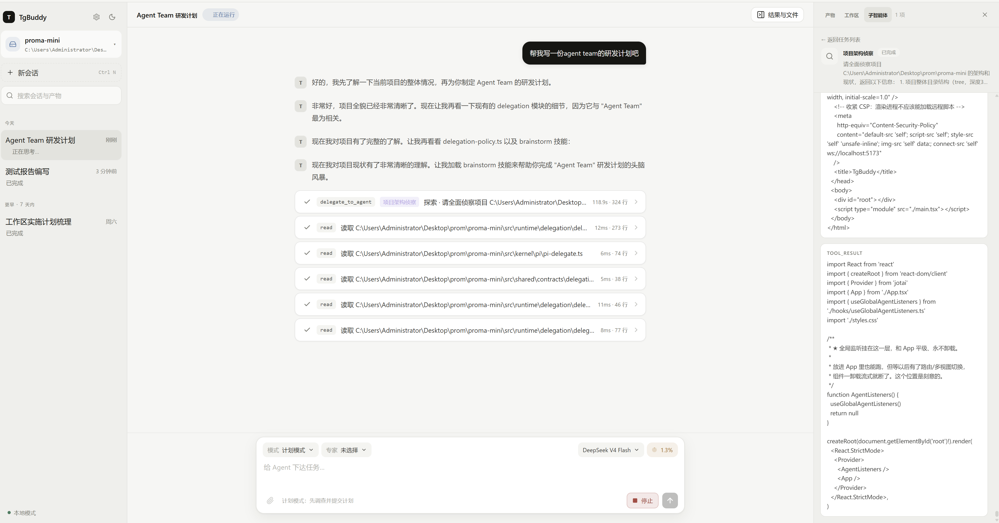
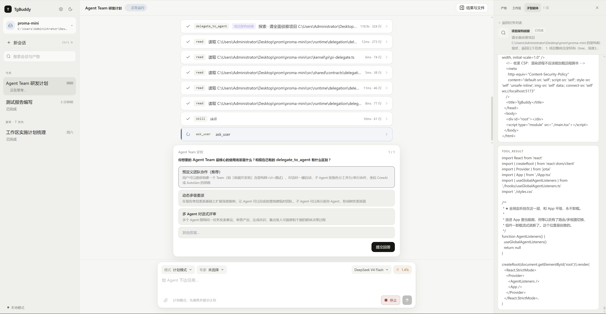
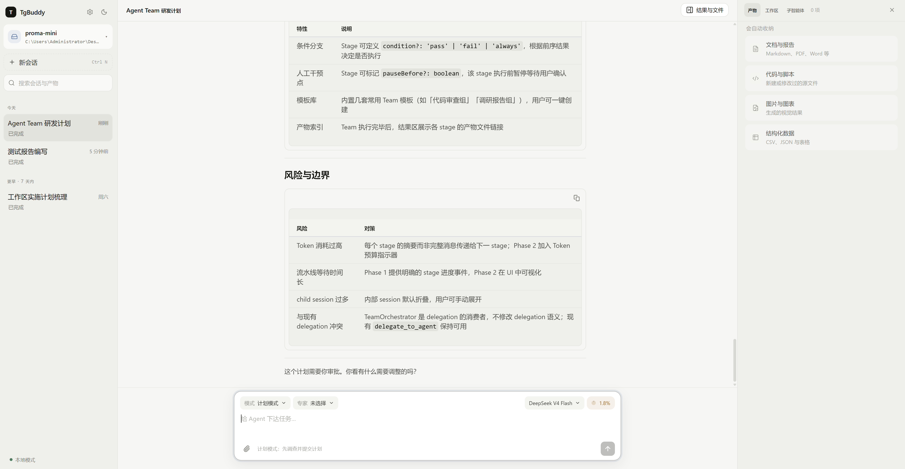
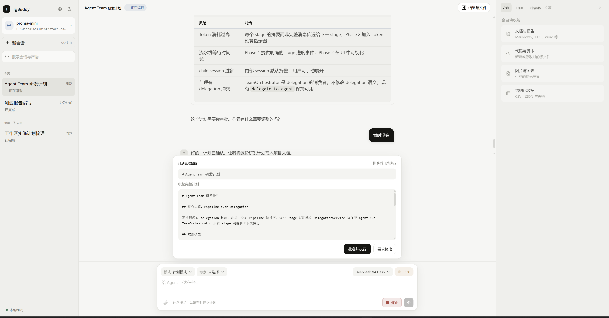
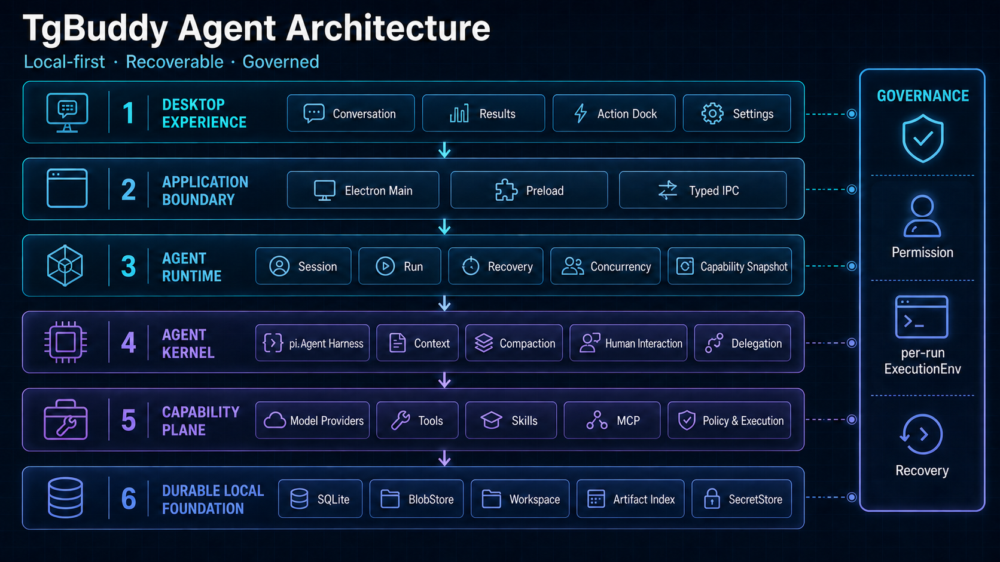

<div align="center">

# TgBuddy

### 面向真实工作流的本地桌面智能体

把模型、工具、Workspace、权限、产物与子智能体统一进一个可恢复、可治理的 Agent Runtime。


</div>

TgBuddy 不是一个把大模型包进聊天窗口的 Demo，而是一套围绕 **Agent 如何安全地完成真实任务** 构建的本地智能体工作台。

它以 Session 与 Run 为运行主线，将模型推理、工具执行、Skill、MCP、Workspace、人机决策、结果产物和单层 Subagent 纳入同一个生命周期；即使应用重启或运行中断，关键状态仍然可以恢复、审计与继续处理。

## 产品能力

| 能力域 | TgBuddy 提供什么 |
|---|---|
| **Agent 工作台** | 会话历史、流式响应、工具过程、计划模式、上下文用量与结果区在同一桌面体验中协同工作 |
| **可恢复运行时** | Session / Run 独立建模，支持并发守卫、停止、失败、中断恢复与 durable completion |
| **受控系统执行** | 文件、命令与 MCP 调用统一经过风险分类、权限规则、人工授权和 per-run ExecutionEnv |
| **能力编排** | Provider、Tool、Skill、MCP 与 Agent Profile 在 Run 启动时形成不可变能力快照 |
| **Workspace 与产物** | 附件、Blob、大型工具输出、工作区文件与 Artifact 索引形成完整结果链路 |
| **人机协作** | 权限确认、计划审批与结构化提问可以暂停 Run，并在用户决策后继续 |
| **单层 Subagent** | Root Agent 可委派 child Run，具备 lineage、预算、权限收窄、状态可见与级联取消 |
| **本地优先数据** | SQLite 保存 canonical state，BlobStore 管理大对象，SecretStore 隔离敏感凭据 |

##  Agent Harness 核心交互

<table>
  <tr>
    <td width="50%" valign="top">
      <strong>Agent 编排</strong><br />
      Root Agent 委派边界清晰的子任务，并集中呈现 Subagent 的执行状态、过程与产出。<br /><br />
      <a href="assets/readme/tgbuddy-agent-orchestration.png">
        
      </a>
    </td>
    <td width="50%" valign="top">
      <strong>人在回路</strong><br />
      Agent 通过结构化提问暂停 Run，在获得用户的明确决策后继续执行。<br /><br />
      <a href="assets/readme/tgbuddy-human-in-loop.png">
        
      </a>
    </td>
  </tr>
  <tr>
    <td width="50%" valign="top">
      <strong>计划分析</strong><br />
      先调查项目并梳理执行阶段、依赖与风险，将“先理解、再执行”固化为流程。<br /><br />
      <a href="assets/readme/tgbuddy-plan-analysis.png">
        
      </a>
    </td>
    <td width="50%" valign="top">
      <strong>审批检查点</strong><br />
      完整计划交由用户批准或要求修改，通过检查点后才进入实际执行。<br /><br />
      <a href="assets/readme/tgbuddy-plan-approval.png">
        
      </a>
    </td>
  </tr>
</table>

## 系统架构

TgBuddy 采用分层、端口驱动的本地应用架构。桌面体验只通过 typed IPC 使用 Runtime；业务语义不依赖 Electron、React、SQLite、Node 文件系统或 pi 的具体实现，所有 adapter 在 Composition Root 中显式装配。



### 分层职责

| 层 | 核心组件 | 主要职责 |
|---|---|---|
| **Product Surface** | Conversation、Results、Action Dock、Settings、Electron Main、Preload、IPC Contracts | 承载桌面交互、流式事件和跨进程边界 |
| **Agent Runtime** | Session、Run、Recovery、Concurrency、Capability Snapshot | 定义一次 Agent 运行的业务语义与状态机 |
| **Agent Kernel** | pi Agent Harness、Context、Compaction、Human Interaction、Delegation | 驱动模型循环、上下文管理、人机决策与子任务 |
| **Capability Plane** | Model Providers、Tools、Skills、MCP Manager | 为每次 Run 提供经过冻结和治理的能力集合 |
| **Policy & Execution** | Invocation Normalizer、Risk Classifier、Authorization Gate、RunExecutionEnv | 在副作用发生前完成风险识别、授权与执行隔离 |
| **Durable Foundation** | SQLite Repositories、Message History、BlobStore、Workspace、Artifact Index、SecretStore | 保存可恢复状态、附件、产物与敏感信息引用 |

### 一次 Run 如何完成

```text
用户输入 / 附件
  -> typed IPC
  -> 恢复 Session 与 Workspace
  -> 创建 Run，并冻结模型与能力快照
  -> pi Agent Harness 驱动模型循环
  -> Provider / Tool / Skill / MCP
  -> 风险分类与 Permission Gate
  -> per-run ExecutionEnv 执行副作用
  -> 持久化 Message / Run / Blob / Artifact
  -> Renderer 流式展示与结果收纳
```

同一个 Session 同时只允许一个 root Provider stream，不同 Session 可以并行。Run 的完成状态只有在消息和结果完成持久化后才会对 UI 可见；应用异常退出后，遗留 Run 会恢复成可解释的中断状态，不会自动重放尚未确认的副作用。

## 工程特性

- **边界清晰**：Runtime 通过 ports 与具体 Provider、存储、文件系统和宿主解耦。
- **显式装配**：不使用通用 DI 容器，`createApplication()` 负责连接所有 adapter。
- **安全前置**：Tool、Skill 与 MCP 共享授权链，敏感凭据不进入 Renderer 或业务数据库正文。
- **状态可靠**：SQLite 是 Session 与 Run 的 canonical storage，JSONL 仅承担 legacy 导入。
- **结果可追踪**：大输出进入 BlobStore，文件结果进入 Artifact 索引，并回到对应 Run。
- **失败可解释**：取消、拒绝、模型错误、工具错误、存储降级与进程中断具有独立语义。
- **架构可执行**：依赖边界由 `check:architecture` 自动检查，而不是只停留在文档约定。

## 技术栈

| 领域 | 技术 |
|---|---|
| Desktop | Electron 39 |
| UI | React 18、Jotai、Tailwind CSS、AI Elements、streamdown |
| Language & Runtime | TypeScript 5、Bun |
| Agent Kernel | `@earendil-works/pi-agent-core`、`@earendil-works/pi-ai` |
| Protocol | Model Context Protocol SDK |
| Persistence | SQLite、BlobStore、Electron safeStorage |
| Quality | Bun Test、Playwright、TypeScript、Architecture Guard |

## 快速开始

### 环境要求

- Windows 10 / 11
- [Bun](https://bun.sh/)
- 可用模型 Provider 的 API Key

### 安装与启动

```bash
bun install
```

```powershell
Copy-Item .env.example .env
```

在 `.env` 中配置模型凭据后启动桌面应用：

```bash
bun run dev
```

### 验证

```bash
bun run probe
bun run probe:compaction
bun run check:architecture
bun run typecheck
bun test
bun run build
```

其中 `probe` 无需启动 Electron，可独立验证 Provider、流式输出、工具调用和多轮上下文链路。

## 目录结构

```text
src/
  shared/contracts/    跨进程 DTO、事件与 typed IPC contract
  runtime/             Session、Run、权限、能力与业务状态机
  kernel/pi/           pi Agent、Tool、Skill、MCP 与 Session 适配
  infrastructure/      SQLite、Blob、Workspace、Secret、MCP transport
  main/                Electron bootstrap、Composition Root 与 IPC handlers
  preload/             安全暴露 window.tgbuddy
  renderer/            桌面产品界面与 feature state

tests/
  unit/                Runtime、Kernel、Infrastructure 与架构边界
  integration/         Run、恢复与消息持久化链路
  e2e/                 Electron 真实用户流程
```

## 当前阶段

TgBuddy 已具备本地 Agent 第一版的核心闭环：可恢复 Session / Run、Workspace、安全授权、Tool / Skill / MCP、附件与 Artifact、结果区、设置中心以及单层 Subagent。当前工作重点是持续提升真实任务中的交互质量、运行稳定性和端到端体验。

---

<div align="center">
  <sub>TgBuddy · Build agents that can act, recover and stay accountable.</sub>
</div>
