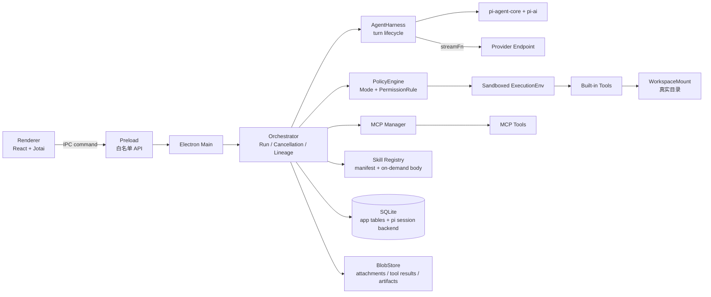
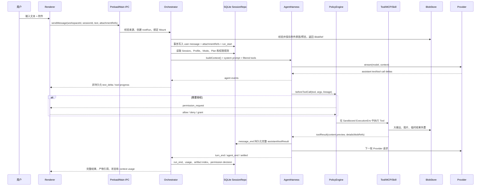

# 001 - TgBuddy 架构设计

## Status

这是当前批准的目标架构。M1 已完成 SQLite canonical Session、pi `AgentHarness`、可恢复 Run、上下文压缩和线性历史操作；以下目标仍未全部落地：Workspace/WorkspaceMount、per-run Sandbox、BlobStore、MCP Manager、Skill Registry 和单层 child delegation。因此文档状态为 `partially-outdated`，表示设计已收敛而实现仍在按 Slice 迁移。

## Summary

TgBuddy 是一个本地优先的 Electron Agent 应用：Renderer 只负责交互，主进程负责编排、权限、持久化和文件访问，pi 只负责模型协议和 Agent loop。一次用户消息从输入框进入主进程后，先绑定逻辑 Workspace 和当前 Mount，再恢复 Session，构造带能力清单的 Harness，经过 PolicyEngine 后调用内置 Tool、MCP Tool 或 Skill；高频流事件只发给 UI，完整消息、工具结果、权限决策和产物引用落到 SQLite，附件和大对象落到 BlobStore。

Team 不是独立的 DAG 产品。第一版只允许主 Agent 通过一个 `delegate_to_agent` 工具同步委派最多 2 个 child，最大深度为 1；child 没有再次委派能力，所有事件、权限、预算和产物都带 lineage。

产品定位不只是一个固定功能的桌面客户端，而是可供二次开发的通用 Agent Workbench。第一版通过仓库内模块化 Runtime 暴露可替换边界，Electron 是完整参考宿主；暂不发布独立 npm SDK，也不承诺第三方插件 ABI。该项目同时作为面试工程作品，要求重要决策具备代码证据、测试、失败恢复说明和可重复的性能/可靠性验证。

## 1. 决策总览

| 主题 | 决策 |
|---|---|
| 内核集成 | Electron 主进程直接集成 `@earendil-works/pi-agent-core` 和 `@earendil-works/pi-ai`，不启动 `pi-coding-agent` 子进程 |
| Agent 生命周期 | Runtime 管理 RunRegistry、恢复、取消、settled 与 Context；`kernel/pi` 使用 pi `AgentHarness` |
| 会话模型 | 逻辑 Session 线性追加，不做分支树；编辑重发用软截断，派生会话用 `originRef` |
| 工作区模型 | Workspace 是逻辑实体；真实目录通过可重新定位的 `WorkspaceMount` 绑定 |
| canonical storage | 先做 packaged Electron integration spike；通过后使用 SQLite。JSONL 仅用于导入、导出、审计和恢复 |
| 大对象 | 附件、完整工具输出、非工作区产物进入 BlobStore；消息只存 BlobRef |
| 权限 | `Mode` 只是权限策略；`Agent Profile` 是角色和能力；`Plan` 是持久化任务状态，三者不混用 |
| Team | 主 Agent -> 单层 child，同步等待，`maxDepth = 1`，每个 root 最多 2 个 child |
| MCP / Skill | MCP 是动态 Tool 来源；Skill 是按需加载的提示能力，完整正文不默认塞入 system prompt |

## 2. 目标、非目标与硬性数字

### 2.1 目标

- 在本地 Electron 应用中完成一次可恢复的 Agent 任务闭环。
- 让用户能看见工具调用、权限等待、压缩和 child 委派过程，但不把高频增量事件膨胀成永久日志。
- 让 Workspace 移动后仍能保留 Session、权限、Plan 和产物归属。
- 让模型上下文、权限边界、文件存储和 UI 状态彼此解耦，便于替换 Provider 或持久化后端。
- 复用 pi 已验证的消息格式、Provider 适配、压缩算法、Tool 截断和 Harness 生命周期。
- 形成可供二次开发的 Runtime 边界，使新的 Tool、Skill、MCP、Storage 和 Agent Profile 不需要修改 Renderer 核心逻辑。
- 为面试和技术评审保留可解释的架构取舍、迁移过程、测试证据和可靠性数字。

### 2.2 非目标

- 不引入 `pi-coding-agent` 的 CLI、TUI、扩展、主题和项目级信任系统。
- 不做完整 Team 实体、模板市场、成员页、任务 DAG、并行调度、路由器或重派系统。
- 不做会话分支、时间旅行、合并和 diff 树。
- 不在第一版引入向量数据库、远程记忆服务或 Office/PDF 全量解析。
- 沙箱不是进程级安全隔离；需要对抗恶意代码时必须使用容器或虚拟机。
- 第一版不拆分独立 npm SDK，不定义跨版本插件 ABI，不引入复杂 DI 容器或服务定位器。

### 2.3 平台扩展原则

第一版的“可扩展”指仓库内的 TypeScript 接口和清晰依赖方向，不等于公共插件生态：

1. Runtime 模块不能 import React 或依赖具体页面状态；Renderer 只能通过 IPC contract 消费它。
2. 扩展点采用小接口和显式工厂，不为了未来场景提前增加通用容器、反射注册或动态模块系统。
3. 每个扩展点必须至少有一个当前消费者或已排入近期 Wave 的消费者，否则暂不抽象。
4. Storage、Tool、Skill、MCP 和 Agent Profile 的实现可以替换，但领域 ID、RunLineage、BlobRef 和错误语义保持稳定。
5. 面试证据属于交付的一部分：spike 记录环境和数字，测试覆盖恢复/并发/权限，ADR 记录被拒绝方案。

### 2.4 预算与上限

| 项目 | 第一版约束 |
|---|---:|
| 一个 root 同时运行的 Provider stream | 1 |
| 单个 root 可启动的 child 数 | 最多 2 个，失败也计数 |
| 委派深度 | `maxDepth = 1` |
| Provider 请求级重试 | 最多 3 次，指数退避上限 15 秒 |
| 自动压缩触发 | `contextTokens > contextWindow - 16K`，产品默认 85% 提醒 |
| 压缩保留的新消息 | 约 20K tokens |
| 可直接进入上下文的工具输出 | 约 32-64KB |
| 超过该大小的完整工具输出 | 写入 Blob，消息只保留预览和引用 |
| 单条持久化文本的保护阈值 | 256K 字符，超出必须截断或外置 |

## 3. 分层与边界



边界规则：

1. pi 的运行时调用只能出现在 `src/kernel/` 和明确的 Harness 适配层；pi 类型可以出现在 `src/shared/`。
2. Renderer 不直接访问任意文件路径、API Key、数据库或 MCP 子进程。
3. 所有文件类 Tool 只能通过 `ExecutionEnv` 访问磁盘；`bash` 仍需 PolicyEngine 逐次授权。
4. SQLite 的 pi 私有表与 TgBuddy `app_*` 表分离，不建立跨表 Foreign Key、Trigger 或对内部字段的依赖。
5. Blob 内容不直接嵌入 pi Session payload；模型请求前才按权限和 Provider 能力 hydrate。

## 4. 核心领域模型

### 4.1 Workspace 与 Mount

Workspace 表示用户看到的逻辑工作区，不代表某个永远不变的目录。

```ts
interface WorkspaceRecord {
  id: string
  name: string
  primaryMountId: string
  createdAt: number
  updatedAt: number
}

interface WorkspaceMount {
  id: string
  workspaceId: string
  rootPath: string
  canonicalPath: string
  status: 'available' | 'missing' | 'permission_denied'
}

interface AppSession {
  id: string
  workspaceId: string
  piSessionId: string
  title: string
  channelId?: string
  modelId?: string
  createdAt: number
  updatedAt: number
}
```

目录移动或重新挂载只更新 `WorkspaceMount.rootPath` 和状态，不改变 `workspaceId`、Session、权限规则、Plan 或产物归属。当前 compatibility Runtime 仍会在 `~/.tgbuddy/workspaces/{id}` 自动创建目录，这是 M2 前的临时实现，不能作为最终模型。

### 4.2 Run、Lineage 与预算

每次用户发送消息创建一个 root Run。child Run 不创建新的顶级会话，而是在同一 root budget 下运行独立的 pi Session。

```ts
interface RunLineage {
  rootRunId: string
  agentRunId: string
  parentAgentRunId?: string
  parentToolCallId?: string
  planTaskId?: string
  sequence: number
}

interface RootBudget {
  rootRunId: string
  maxTurns: number
  maxChildRuns: number
  maxTotalTokens: number
  usedTurns: number
  usedTokens: number
}
```

预算在宿主层统计，不能让 parent 和 child 各自维护一份“局部剩余量”。root cancel 必须级联 child、待处理权限、`ask_user` 和 delegate Tool。

### 4.3 Mode、Profile、Invocation、Plan

- `Mode`：默认权限、计划模式、完全访问，是 PolicyEngine 的输入。
- `Agent Profile`：角色名、system prompt、模型偏好、可见工具和技能范围。
- `Invocation`：一次实际运行使用的 root Agent、用户选定 Profile 或 child Profile。
- `Structured Plan`：持久化任务状态，第一版为扁平状态机：`pending -> running -> completed | failed | skipped`，同一时间最多一个 `running`。

Plan 不是 mode。计划模式限制副作用，Plan 记录任务本身的步骤、证据和恢复状态。

## 5. 用户消息到结果的完整数据流

### 5.1 主流程



### 5.2 高频事件与持久事件

不把每个流事件都当成数据库消息：

| 事件 | Renderer | SQLite |
|---|---|---|
| `text_delta` | 立即显示 | 不保存 |
| `thinking_delta` | 可选显示 | 不保存 |
| Tool progress | 立即显示，节流 | 不保存高频增量 |
| user message | 显示 | 保存完整消息 |
| assistant message | 流结束后合并显示 | `message_end` 保存 |
| toolResult | 卡片预览 | 保存完整可恢复结果或 BlobRef |
| run start/end | 状态栏 | 保存 |
| permission decision | 卡片 | 保存 |
| compaction | 分隔线 | 保存摘要、切点和原始历史索引 |
| delegation | 嵌套过程 | 保存 lineage、结果和预算 |
| MCP error / Skill invocation | 提示 | 保存诊断事件 |

IPC 仍保持两个逻辑通道：`agent` 通道承载 pi 事件，`host` 通道承载权限、压缩、委派、MCP、标题和宿主错误。所有 child agent 事件都必须附带 `parentToolCallId` 和 `agentRunId`。

## 6. Harness、上下文和系统提示词

### 6.1 Harness 生命周期

目标生命周期如下：

```text
SessionRepo.load
  -> Session.buildContext()
  -> 创建 turn snapshot
  -> system prompt / resources / filtered tools
  -> Provider stream
  -> tool call
  -> beforeToolCall / permission
  -> tool result
  -> message_end 持久化
  -> turn_end / save point
  -> agent_end / settled
```

`AgentHarness` 已提供 Session、JSONL/Memory backend、compaction、Skills、Prompt Templates、Tool hooks、steering/follow-up queue、save point 和 settled 生命周期。M1 已复用其 Session、save point、Tool hooks 与 Agent loop，并在外部接入 SQLite、Runtime Context 和 Electron IPC；后续继续接入 PolicyEngine、MCP、Skill、BlobStore。

### 6.2 为什么 system prompt 不会无限变长

工具和 Skill 的数量增加，不代表把所有正文都拼进 system prompt。采用四层预算：

1. **静态核心提示**：身份、输出约定、Workspace 安全边界、当前 Mode，整个 Session 尽量不变，便于 Provider cache。
2. **能力 manifest**：只放启用 Tool 的名称、短描述和 JSON Schema；未启用的 Tool 不进入上下文。
3. **Skill 摘要**：默认只放 `name`、`description` 和路径。完整 `SKILL.md` 在用户显式 `/skill` 或模型决定调用时加载。
4. **动态资源**：当前时间、Mount 状态、Plan 摘要、MCP 连接状态按 turn snapshot 注入，不能把全部历史文件内容塞进 prompt。

能力装配由 `Agent Profile + Workspace + Mode + MCP status` 决定。context usage 必须分类统计系统提示、工具 schema、Skill 摘要、MCP 工具和消息；当上下文超过预算时先压缩消息，不通过无限删 Tool schema 来隐藏能力。

### 6.3 压缩与恢复

pi 的 `shouldCompact`、`prepareCompaction`、`compact`、`findCutPoint`、`estimateContextTokens` 和 `generateSummaryWithUsage` 作为算法层复用，TgBuddy Runtime 负责触发和恢复：

- 触发前给用户 3 秒“稍后”窗口。
- 压缩期间输入不锁死，新消息进入队列。
- 切点必须落在 user/assistant 边界，不能拆开 toolCall/toolResult。
- 摘要和 `firstKeptEntryId` 写入独立 compaction record，原始消息继续保留。
- 压缩失败不能覆盖原始历史；只发送 host error 并恢复原 context。
- 禁止在 Tool 已产生副作用后整轮自动重放；Provider 请求级重试必须区分可重试错误和已执行 Tool 的状态。

## 7. Tool、MCP、Skill 与权限

### 7.1 Tool Registry

Tool 统一为 pi `AgentTool`，来源分为：

- 内置文件/命令 Tool：`read`、`write`、`edit`、`bash`，以及项目自定义 `glob`、`delete`、`ask_user`、Plan Tool。
- MCP Tool：由 MCP Manager 动态发现，名称使用 `mcp__{server}__{method}`。
- 委派 Tool：只有 root Agent 看见 `delegate_to_agent`，child Agent 不加载它。

Tool 的 `content` 是给模型的最小可用结果；`details` 是给宿主和 UI 的结构化结果。不能依赖 pi 内置 Tool 的 `details` 形状，产物识别从工具调用参数和成功的 toolResult 投影得到。

### 7.2 MCP Manager

MCP 不属于 pi core，由 TgBuddy 自建：

1. 读取 `app_mcp_servers` 配置并启动/连接 Server。
2. 发现 tools、缓存 schema、检测连接状态。
3. 将 MCP `inputSchema` 适配为 pi Tool schema。
4. 通过 PolicyEngine 按 `server.method`、只读/写入和 workspace 绑定判定权限。
5. 将长响应写入 BlobStore，返回 preview + BlobRef。
6. 连接失败、schema 变化、进程退出都生成 host event，不伪装成模型空响应。

Server 关闭后，其 Tool 必须从当前 Invocation 的可用列表消失。MCP 不能因为名字有 `mcp__` 前缀就绕过 plan 或 permission。

### 7.3 Skill Registry

Skill loader 复用 pi 的递归扫描、frontmatter 校验、ignore 规则和 `formatSkillsForSystemPrompt` / `formatSkillInvocation`。Windows 上对 ExecutionEnv 做 path normalization，规避 pi 0.82.1 `path.relative()` 的分隔符问题。

Skill 只保存 manifest 和文件路径；加载正文时限制在 Workspace 或应用内置目录内，禁止通过 Skill 路径绕过沙箱。内置 Skill 用 `version` 做 semver 更新，工作区 Skill 随 Workspace 切换。

### 7.4 PolicyEngine 与 Sandboxed ExecutionEnv

权限判定的粒度是 `tool × match scope × expiry`：

```ts
interface PermissionRule {
  tool: string
  match: 'tool' | 'path' | 'prefix' | 'method'
  pattern: string
  scope: 'session' | 'project' | 'global'
  workspaceId: string
  neverPersist: boolean
}
```

- `Mode` 先做粗粒度策略：默认权限、计划模式、完全访问。
- Rule 再做细粒度匹配；默认有效期为当前 Workspace。
- `rm`、`sudo`、危险重定向、`curl | sh`、`git push --force` 等破坏性操作 `neverPersist = true`。
- 计划模式只能执行只读操作和明确允许的计划文件写入；不能默认放行所有 MCP。
- `ExecutionEnv` 做 canonical path 校验，必须处理 symlink、junction 和 Windows reparse point，防止通过链接越出 Mount。
- 运行中删除 Session 前必须先 abort；清理所有 pending permission、plan approval、ask_user 和 child。

沙箱是模型误操作防线，不是恶意代码隔离。`bash` 无法静态证明命令只访问 Workspace，因此实际防线是权限询问、危险前缀规则和可选容器执行。

## 8. 消息、附件、工具输出与产物

### 8.1 Session 消息

pi 的 `Message` 是中立格式，TgBuddy 不做 Provider 级二次归一化。只增加 envelope、系统通知、compaction metadata 和 BlobRef。持久化消息必须保留 thinking/signature/toolCall 等字段，不能为了 UI 方便丢失 Provider 续接所需的签名。

### 8.2 附件

```ts
interface AttachmentRef {
  blobId: string
  sha256: string
  mimeType: string
  byteSize: number
  originalName?: string
  width?: number
  height?: number
  previewBlobId?: string
}
```

流程是：原图写入 `blobs/attachments/{blobId}`，可选缩略图写入 `blobs/previews/{blobId}`，消息只保存 `AttachmentRef`。调用支持图片的 Provider 时，Runtime 按权限和大小把 Blob hydrate 成 `ImageContent`；普通文本附件先转为受限的文本引用，超长内容要求模型通过 read Tool 读取。

Renderer 只能通过受控 IPC 获取预览，不能拿到任意绝对路径或 API Key。

### 8.3 Tool 输出

小结果可将 preview 送进模型；大结果完整写入 `blobs/tool-results/{blobId}`，消息保存：

```ts
interface ToolOutputRef {
  preview: string
  blobId?: string
  byteSize: number
  truncated: boolean
  mimeType?: string
  fullOutputAvailable: boolean
}
```

pi 的 `read` 和 `bash` 已有 head/tail 截断、`fullOutputPath` 和 truncation metadata。TgBuddy 必须把临时路径转成自己的 BlobRef，不能把 pi 临时路径直接暴露给 Renderer 或长期存储。

### 8.4 Workspace 产物

写入真实 Workspace 的文件保持用户可见，数据库只存索引：

```ts
interface ArtifactRecord {
  id: string
  workspaceId: string
  sessionId: string
  runId: string
  agentRunId: string
  kind: 'document' | 'code' | 'image' | 'data'
  relativePath: string
  sha256?: string
  size?: number
  parentToolCallId?: string
  createdAt: number
}
```

非 Workspace 二进制生成物写入 `blobs/artifacts/{artifactId}`。结果区按时间倒序展示，标注产生者（root、Skill 或 child），不在 UI 内直接编辑工作区文件。

## 9. SQLite canonical storage 与文件布局

### 9.1 选型结论

先完成 packaged Electron integration spike：1000 entries 创建/恢复、两个 Session 交替追加、强杀恢复、compaction 恢复、delete/cleanup、WAL backup、旧 JSONL 幂等导入。Electron 39.8.10 的 Node 22.22.1 已验证 `node:sqlite` 可用；当前 `package.json` 使用 `electron ^39.0.0`，因此必须在打包环境而不是 Bun probe 环境中再次验证。

spike 通过后，SQLite 是 canonical storage，原因是 Workspace、Session catalog、权限规则、Plan、MCP 配置、产物索引都需要结构化查询和事务更新；当前 `sessions.json` 的全量重写会随会话数量产生写放大。

### 9.2 布局

```text
userData/
├── app-config.json
├── tgbuddy.db
├── blobs/
│   ├── attachments/
│   ├── tool-results/
│   ├── artifacts/
│   └── previews/
├── backups/
└── exports/
```

pi SQLite backend 的私有表由 backend 管理，例如 `migrations`、`sessions`、`session_entries`、`session_sequences`、`branch_entries`、`session_materialized`、`entry_materialized`。TgBuddy 只使用 `app_*` 表：

```text
app_schema_migrations
app_workspaces
app_workspace_mounts
app_sessions
app_runs
app_permission_rules
app_plan_runs
app_plan_tasks
app_artifacts
app_mcp_servers
app_agent_profiles
app_imports
```

`app_sessions.pi_session_id` 只做映射，不依赖 pi 私有字段。每个 Session storage 必须显式 `cleanup()`。WAL 备份必须先正确 checkpoint，不能只复制主 `.db` 文件。

### 9.3 JSONL 的保留位置

JSONL 保留为：

- 旧版本 `sessions/{id}.jsonl` 的导入来源。
- 用户主动导出的会话格式。
- 调试和人工审计日志。
- SQLite 损坏时的紧急恢复副本。

JSONL 不再是长期 canonical transcript，也不承载完整 Base64 图片或无限大的 Tool 输出。

## 10. 最小多 Agent 协作契约

### 10.1 委派输入与结果

```ts
interface DelegateInput {
  profileId: string
  objective: string
  contextRefs: string[]
  expectedOutput?: string
  planTaskId?: string
}

interface AgentResult {
  status: 'completed' | 'failed' | 'aborted' | 'budget_exceeded'
  summary: string
  artifacts: ArtifactRef[]
  evidence: EvidenceRef[]
  usage: Usage
  error?: string
}
```

`contextRefs` 指向 Session 消息、Blob 或工作区文件，不复制整段历史。child 在自己的 pi Session 中运行，结果通过 toolResult 回到 parent；UI 将 child 事件折叠在对应的 `parentToolCallId` 下。

### 10.2 并发与取消

- 同一 root 只允许一个 parent Provider stream；child 可以执行，但不能通过一个覆盖整个 `agent.prompt()` 的 Stream Gate 造成死锁。
- Stream Gate 只能包一层 Provider `streamFn`，不能包整个 Agent prompt。
- parent 等待 child 时，parent 的 delegate Tool 可以挂起；不能阻塞 child 必须使用的全局事件循环。
- root cancel 级联 child、permission、MCP request 和 Blob 临时写入。
- child 不得加载 `delegate_to_agent`，避免无限递归。

## 11. 失败模式、恢复和可观测性

| 失败 | 必须行为 |
|---|---|
| Provider `stream` error | 订阅并显示 error 事件，不能表现为“模型不说话” |
| 401/模型不存在/格式错误 | 不重试，保存 host error 和原始诊断 |
| 429/网络超时 | 最多 3 次请求级重试，退避可被 abort |
| Tool 已执行后重试 | 不整轮重放；只重试安全的下一次 Provider 请求 |
| compaction 失败 | 保留旧 context 和原始消息，标记失败，不覆盖历史 |
| SQLite 写失败 | 运行进入 degraded 状态，停止继续产生副作用，提示导出/恢复 |
| Blob 写成功但 DB 事务失败 | 记录 orphan blob，后台清理；不能把不存在的 BlobRef 写入消息 |
| Workspace Mount 丢失 | Session 可读，Tool 进入 blocked，等待用户重新定位 Mount |
| symlink/junction 越界 | canonical path 校验拒绝并记录安全事件 |
| Electron 关闭 | abort root，清掉挂起请求，保存最后一个 save point |

需要记录的指标：每个 root/child 的 turn、token、重试次数、Tool 延迟、授权等待时长、压缩前后 token、Blob 大小、MCP 连接状态和 SQLite checkpoint 延迟。`text_delta` 等高频事件只用于实时 UI，不写指标明细表。

## 12. 安全边界

- API Key 只存在主进程安全存储/系统钥匙串，Renderer 只拿到脱敏状态。
- PermissionRule 必须绑定 `workspaceId`，不能让一个项目的“总是允许”泄漏到另一个 Workspace。
- `~/.tgbuddy`、`.ssh`、`.aws` 等敏感目录默认拒绝；Workspace 外的文件类 Tool 默认拒绝。
- 所有路径在校验前 canonicalize；不能只做字符串前缀比较。
- MCP Server 的启动命令、环境变量和 Secret 由主进程管理，Renderer 不能直接 spawn。
- 生成物和附件展示采用 Blob ID + 受控 IPC，不向 UI 暴露任意文件系统路径。

## 13. 当前代码与目标架构的差距

| 当前实现 | 目标修正 |
|---|---|
| Runtime + `kernel/pi` 已接管 Session/Run/Context | 在 M2/M3 注入 WorkspaceMount、PolicyEngine、Tool/Skill/MCP snapshot |
| SQLite catalog + pi SQLite Session backend | 在 M4 增加 Blob/Artifact；JSONL 仅保留兼容导入与未来导出 |
| `resolveWorkspace()` 创建 `~/.tgbuddy/workspaces/{id}` | 引入 WorkspaceRecord/WorkspaceMount，默认 Mount 必须由用户选择或明确创建 |
| `configureSandbox()` 使用全局 setter | 改为每个 Run 独立的 `SandboxedExecutionEnv`，禁止并发 Session 互相覆盖 |
| Composition Root 使用 128-bit UUID | 后续领域 ID 继续共用注入式生成器，不回退到短随机值 |
| 权限规则部分按工具匹配 | 规则必须绑定 Workspace、scope、危险操作 `neverPersist` 和 lineage |
| 现有附件/大输出尚未 Blob 化 | 引入 BlobStore 和 BlobRef，禁止把大 Base64 放入 pi payload |
| MCP、Skill、child delegation 尚未形成独立 Runtime | 分别增加 MCP Manager、Skill Registry、Delegation Runtime，保持 pi 调用边界清晰 |

## 14. 替代方案与取舍

### 采用 SQLite，而不是长期 JSONL

放弃了 JSONL 的直接可读和简单追加，换取事务、索引、并发追加、Workspace/Run/Artifact 查询和崩溃恢复。JSONL 仍作为导入、导出和恢复格式，保留人工可读性。

### 直接集成 pi，而不是 spawn coding-agent

放弃现成 CLI/TUI、grep/find/ls、扩展和设置系统，换取 Electron 内部权限 UI、单进程 child 编排、可控 Blob/Workspace 和更小的打包体积。

### 单层 child，而不是完整 Team DAG

放弃并行、chain、router、重派和复杂任务可视化，换取可预测的取消、预算、权限和 UI 语义。只有当真实任务证明单层同步委派不足时才扩展。

### 信封模式，而不是 Provider 归一化

保留 pi 消息原样，避免丢失 thinking/signature/toolCall 字段；TgBuddy 只增加 envelope 和宿主通知。

## 15. 假设与复审触发器

### 假设

- 第一版是单机 Electron，数据默认不离开本机，单进程可管理所有 root Run。
- 用户同时运行的 Session 数量远低于需要分布式数据库的规模；结构化查询主要是本地 UI 和恢复。
- 工作区文件由用户和 Agent 共享，Agent 不是独立构建沙箱。
- Provider 支持 pi 的标准消息和 Tool calling；不保证所有第三方网关都支持图片或 thinking。

### 复审触发器

- SQLite packaged spike 在目标 Electron 版本失败，或 WAL/强杀恢复无法稳定通过。
- 单个 Workspace 超过 100GB Blob 或超过 10,000 个 Session，导致本地查询、备份或迁移变慢。
- 需要真正的恶意代码隔离、远程协作或多机调度。
- 单层 child 无法覆盖主要任务，且需要并行/依赖/重派语义。
- pi 的 Session、Harness 或消息字段出现破坏性变更。

## References

- `docs/02-功能范围.md`
- `docs/06-设计决策.md`
- `src/runtime/`
- `src/kernel/pi/`
- `src/infrastructure/sqlite/`
- `src/main/permission-service.ts`
- `src/main/tools/sandboxed-env.ts`
- `src/shared/types/message.ts`
- `src/shared/types/session.ts`
- `@earendil-works/pi-agent-core@0.82.1`
- `@earendil-works/pi-coding-agent@0.82.1`（仅作设计参考，不安装）
- `@earendil-works/pi-storage-sqlite-node@0.82.1`（SQLite Session backend 参考）
